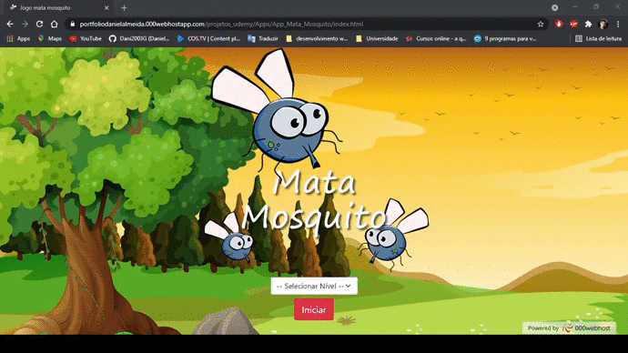

<h1 align="center">
    
    <br>
    <figcaption>Aplicativo em execução</figcaption>
</h1>

<h3 align="center">
    <a href="https://portfoliodanielalmeida.000webhostapp.com/projetos/app_mata_mosquito/">Acessar demonstração</a>
</h3>

---

## 📋 Sobre
O aplicativo mata mosquito foi desenvolvido dentro do curso [Desenvolvimento Web Completo 2021](https://www.udemy.com/course/web-completo/) com o intuito de colocarmos em prática todo o conteudo estudado na seção 8.

---

## 🚀 Tecnologias utilizadas

- [JavaScript](https://www.w3schools.com/js/default.asp)

- [HTML5](https://www.w3schools.com/html/default.asp)

- [CSS3](https://www.w3schools.com/css/default.asp)

- [Bootstrap 4](https://getbootstrap.com/docs/4.6/getting-started/introduction/)

---

## 📁 Como baixar o projeto
``` bash

    # Clonar o repositório
    $ git clone https://github.com/Dani2003G/app_mata_mosquito

    # Entrar no diretório
    $ cd app_mata_mosquito

    # Instalar as dependências
    $ yarn install

    # Iniciar o projeto
    $ yarn start
```